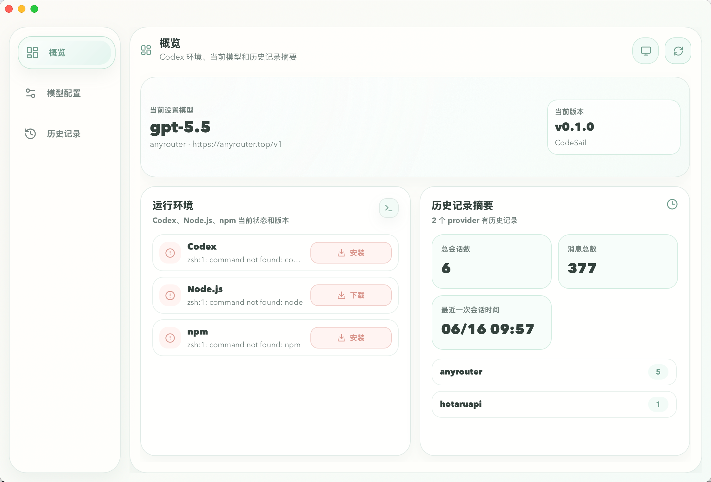
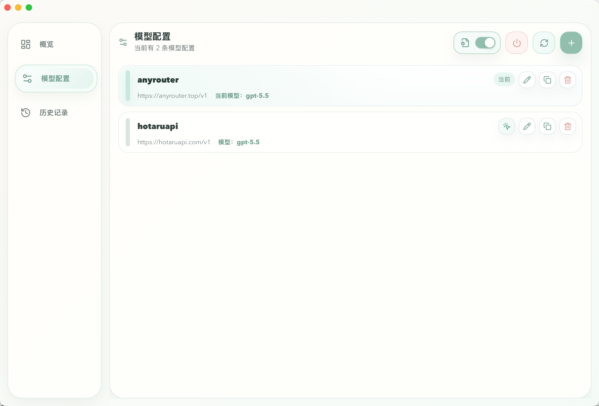
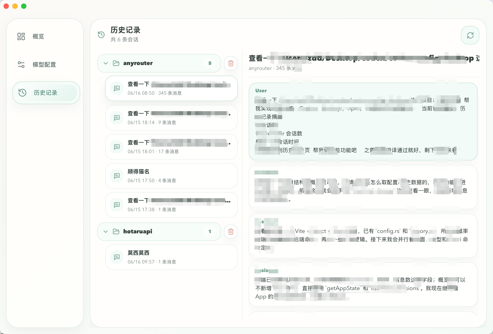

# CodeSail

CodeSail 是一个用于管理 Codex CLI 和 Claude Code 配置的跨平台桌面应用。它把 provider、model、token、本地配置文件和历史会话集中到一个清晰的图形界面里，适合经常切换模型和供应商的本地 AI 工具用户。

> 当前项目处于早期版本，主要面向本地配置管理。欢迎在开源后继续完善安装包、自动更新和更多平台适配。

## 功能特性

- 概览 Codex、Claude Code、Node.js、npm 的可用状态和版本
- 查看当前 app 版本、当前设置模型和历史记录摘要
- 管理 Codex CLI 的 `model_providers`
- 管理 Claude Code 的 API 相关环境配置
- 新增、编辑、复制、删除 provider 配置
- 拉取 provider 的 `/models` 列表并保存模型
- 一键设置当前 provider 和 model
- 可选择是否同步写入 Codex 配置文件
- 保存 token，并在切换当前模型时同步 `auth.json`
- 查看、恢复、删除本地 Codex 历史会话
- 支持浅色、深色、跟随系统主题
- 支持在终端中打开 Codex 或 Claude Code，并支持重启 Codex
- 支持系统托盘快速切换当前模型配置

## 截图

概览界面



模型配置界面



历史记录界面



## 技术栈

- Tauri 2
- React 18
- Vite
- TypeScript
- Rust
- SQLite
- `toml_edit`

## 工作方式

CodeSail 会读取并维护 Codex CLI 使用的本地配置：

- 默认配置文件：`~/.codex/config.toml`
- 默认认证文件：`~/.codex/auth.json`
- 支持 `CODEX_CONFIG` 指定自定义 `config.toml`
- 本地 provider 数据：`~/.codex/codex-config-desktop.sqlite3`
- 本地 token key：`~/.codex/codex-config-desktop.key`

Claude Code 配置会同步到：

- 默认设置文件：`~/.claude/settings.json`
- 默认历史目录：`~/.claude/projects`

数据库文件名目前保留旧项目名，是为了兼容已经安装使用过的本地数据，避免项目改名后丢失已有 provider 和 token。

## 开发环境

需要先安装：

- Node.js
- npm
- Rust 和 Cargo
- macOS: Xcode Command Line Tools
- Windows: Tauri 2 所需的 WebView2 和 Visual Studio C++ Build Tools

如果刚安装 Rust，当前终端可能需要重新加载 PATH：

```bash
. "$HOME/.cargo/env"
```

## 本地开发

安装依赖：

```bash
npm install
```

启动桌面开发环境：

```bash
npm run tauri:dev
```

只启动前端开发服务：

```bash
npm run dev
```

默认前端端口是 `1420`。

## 构建

校验前端构建和后端测试：

```bash
npm run check
```

打包桌面应用：

```bash
npm run tauri:build
```

构建产物会由 Tauri 输出到 `src-tauri/target/release/bundle/`。

## 安装说明

当前 GitHub Releases 里的 macOS 安装包尚未接入 Apple Developer 签名和公证。首次从 GitHub 下载并安装后，如果系统提示“CodeSail 已损坏，无法打开”，通常是 Gatekeeper 拦截了未签名应用，不代表安装包真的损坏。

把 App 拖到“应用程序”后，可以在终端执行：

```bash
xattr -cr /Applications/CodeSail.app
```

然后再打开 CodeSail。后续接入 Apple Developer 证书、签名和 notarization 后，就不需要这一步。

## 项目结构

```text
.
├── docs/                 # 设计和执行计划文档
├── src/                  # React 前端
│   ├── lib/              # Tauri API 封装和类型
│   ├── App.tsx           # 主界面
│   └── styles.css        # 界面样式
├── src-tauri/            # Tauri/Rust 后端
│   ├── src/config/       # provider、模型列表、健康检查、更新检查
│   ├── src/codex_config.rs
│   ├── src/claude_config.rs
│   ├── src/history.rs    # Codex 历史会话读取和管理
│   └── tauri.conf.json   # Tauri 应用配置
├── package.json
└── README.md
```

## 安全说明

- CodeSail 不上传 provider 配置或 token
- token 保存在本机 SQLite 数据库中，并使用同目录的本地 key 加密
- `auth.json` 只同步当前 provider 所需的 token
- 写入 `config.toml` 前会创建备份文件

当前 token 加密主要避免明文出现在数据库里；本地 key 仍存放在用户配置目录中，不等同于 macOS Keychain 或 Windows Credential Manager 级别的系统密钥保护。

请仍然把 `~/.codex` 视为敏感目录，不要把其中的数据库、key、`auth.json` 或包含 token 的配置提交到 GitHub。

## 路线图

- 增加正式安装包和发布流程
- 增加 GitHub Releases 版本检查
- 增加应用内更新提示
- 补充截图和使用文档
- 补充自动化测试
- 优化 Windows/Linux 平台体验

## 贡献

欢迎提交 issue 或 pull request。建议在提交前至少运行：

```bash
npm run check
```

如果改动涉及 UI，请附上截图或录屏，方便确认布局和交互效果。

## 许可证

待补充。开源前建议添加一个明确的 `LICENSE` 文件，例如 MIT、Apache-2.0 或其他你希望采用的许可证。

## 文档

- [执行计划](docs/EXECUTION_PLAN.md)
